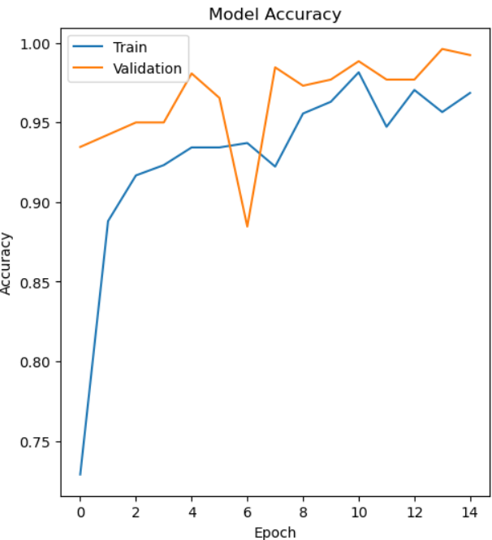

# Face Mask Detection using Deep Learning

## Project Overview
This project develops a computer vision system to detect whether a person is wearing a face mask or not.  
The solution is designed for potential use in healthcare environments where monitoring mask compliance is important.

The model classifies facial images into two categories:
- With mask  
- Without mask  

---

## Approach

- Image preprocessing (resizing, normalization)
- Feature extraction from image data
- Training a deep learning model for binary image classification

## Example Input

## Model Performance


---

## Methodology

- Data loading and labeling of mask / no-mask images  
- Image preprocessing and preparation  
- Model training using deep learning techniques  
- Evaluation on validation/test data  

---

## Results

- The model successfully classifies images of faces with and without masks  
- Demonstrates the effectiveness of deep learning for image classification tasks  

---

## Technologies Used

- Python  
- TensorFlow / Keras  
- NumPy  
- Matplotlib  

---

## Repository Structure

```text
Mask-Detection/
├── README.md
├── mask_detection_model.ipynb
